# Cross-System Interaction Diagrams

Visual documentation of how Project Destiny systems interact.

## Architecture Overview

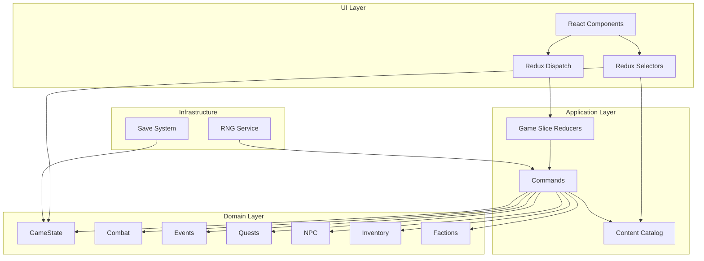

---

## EndDay Orchestration

The `endDay` command orchestrates 15 simulation phases:

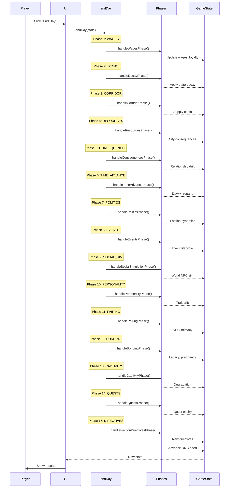

---

## Combat Encounter Flow

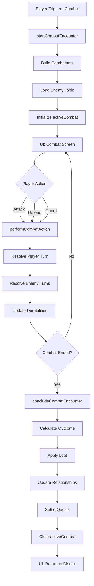

---

## Event System Flow

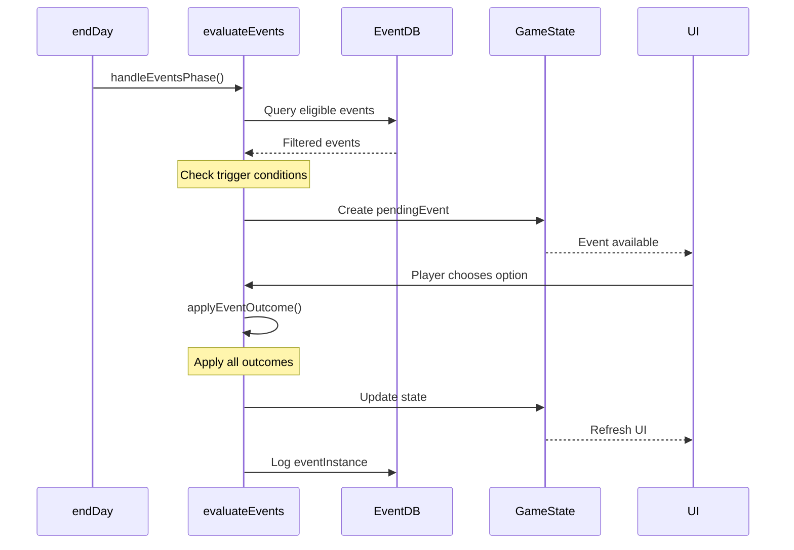

---

## Quest Lifecycle

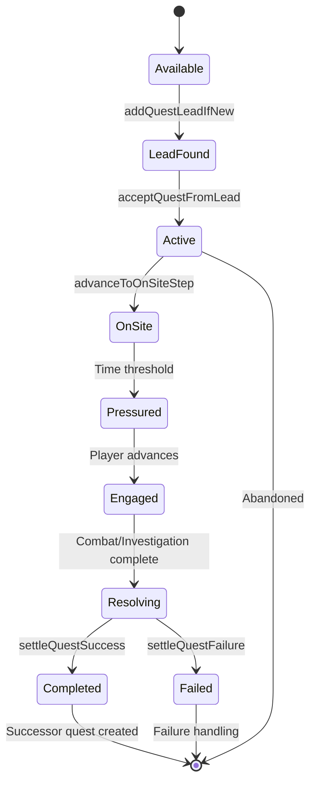

---

## Inventory System Flow

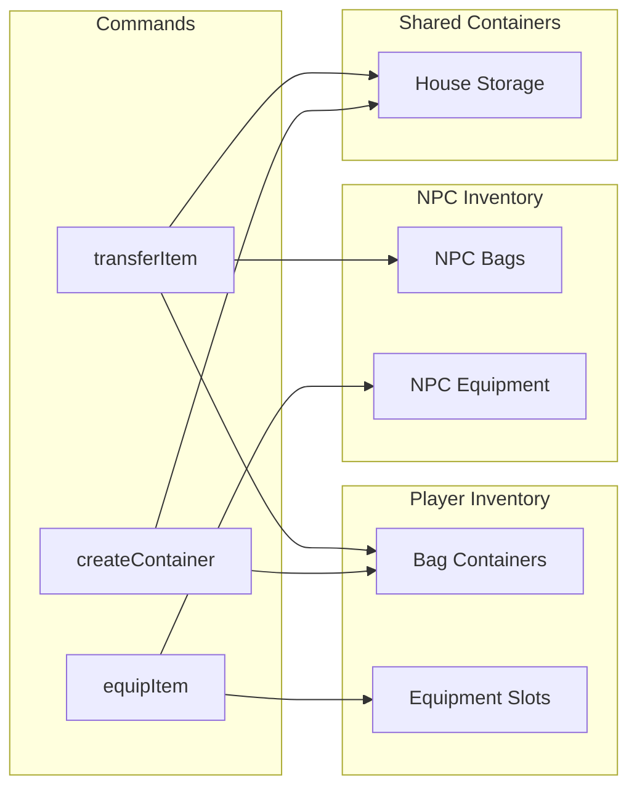

---

## Faction System Interaction

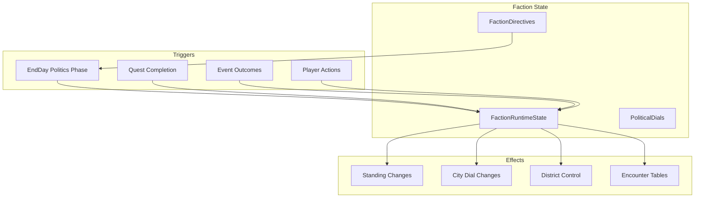

---

## NPC Agency Cycle

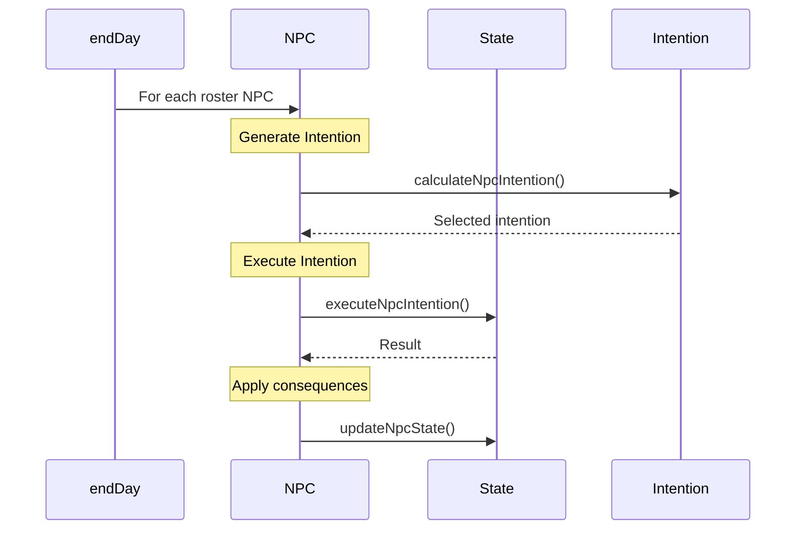

---

## Save/Load Flow

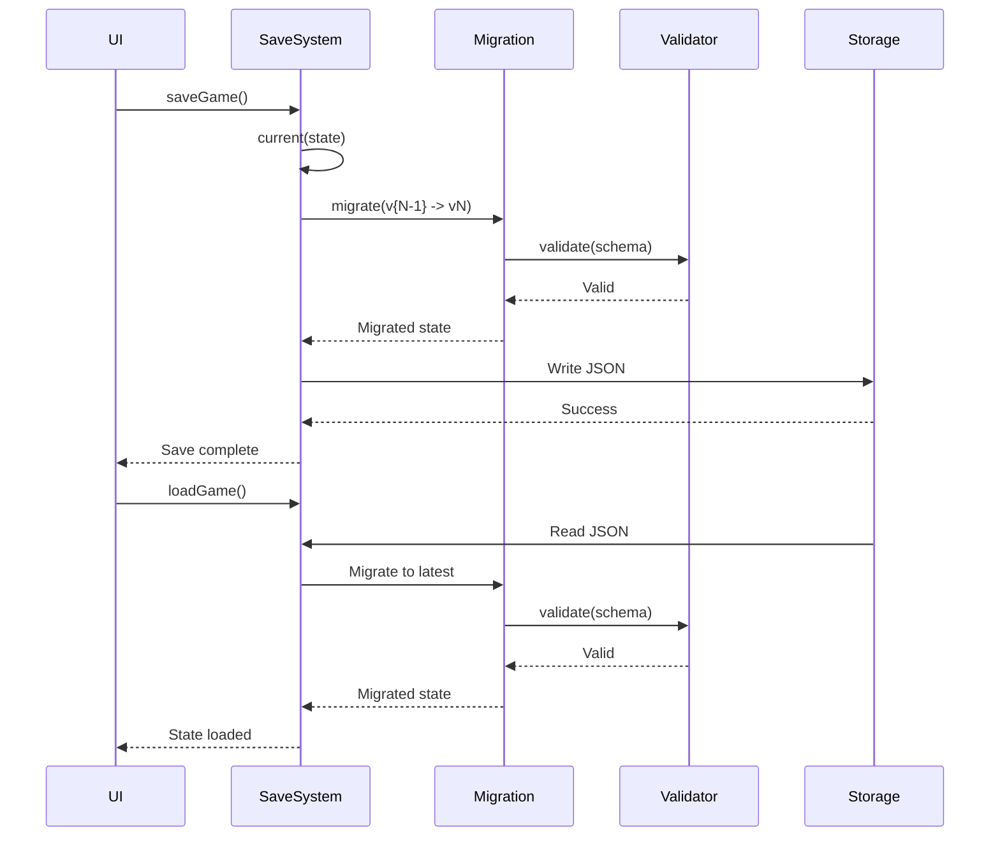

---

## Relationship System

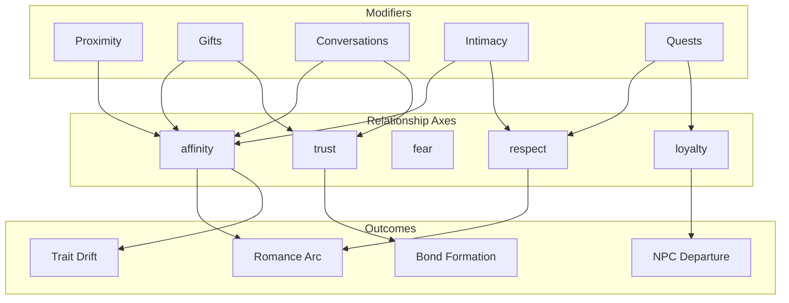

---

## City Resource System

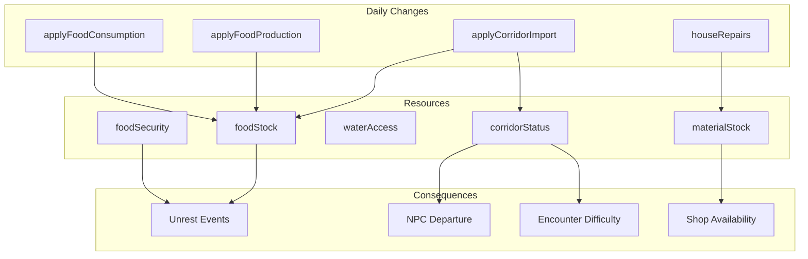

---

## System Dependencies

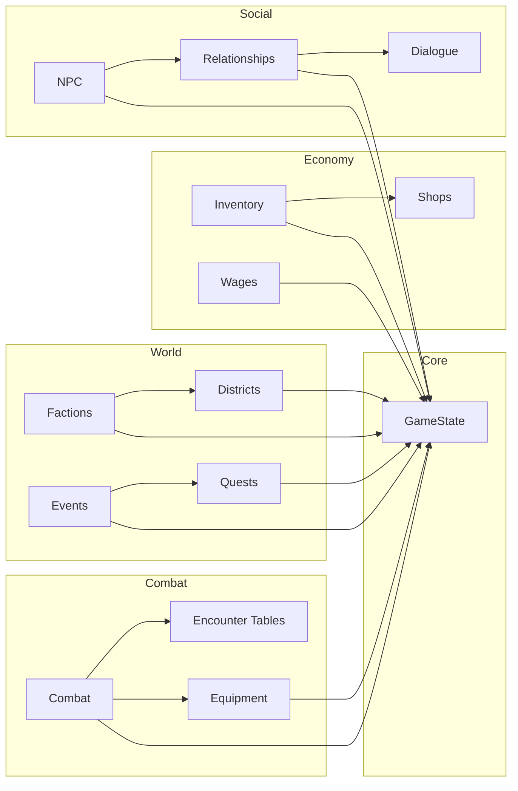

---

## Data Flow Summary

| System | Primary State | Read By | Written By |
|--------|---------------|---------|------------|
| Combat | `activeCombat` | Combat UI, Commands | `startCombatEncounter`, `concludeCombatEncounter` |
| Inventory | `inventoryState` | All UI, Commands | `equipItem`, `transferItem` |
| Relationships | `relationships` | Social UI, Commands | `applyRelationshipDelta`, `courtNpc` |
| Quests | `activeQuests` | Quest UI, Commands | Quest lifecycle commands |
| Factions | `factionStandings` | All systems | `applyFactionActivity`, Event outcomes |
| Events | `pendingEvents`, `eventInstances` | Event UI, Commands | `evaluateEvents`, `applyEventOutcome` |
| NPCs | `roster`, `worldNpcStates` | All systems | `recruitNpc`, `dismissNpc`, Agency |
| Resources | `cityResources` | Resource UI, Commands | `applyFoodConsumption`, `applyCorridorImport` |

---

## See Also

- [Command API Reference](./commands.md) - All state transformers
- [GameState Data Dictionary](./game-state.md) - Complete state structure
- [Event System Documentation](./events.md) - Event details
- [Testing Strategy](./testing-strategy.md) - How to test interactions
